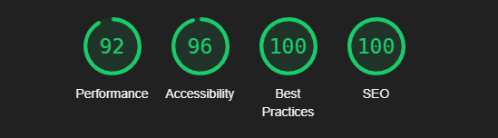
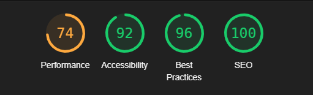

# ♟️ Клуб четырёх коней

<div align="center">

[](https://developer.mozilla.org/ru/docs/Web/HTML)
[](https://developer.mozilla.org/ru/docs/Web/CSS)
[](https://developer.mozilla.org/ru/docs/Web/JavaScript)
[](https://tiigrus.github.io/chess-club-landing/)

**[🌐 Посмотреть сайт](https://tiigrus.github.io/chess-club-landing/)** · **[🎨 Макет в Figma](https://www.figma.com/design/0xXfupPNU3aZxPqFbmhCKb/%D0%94%D0%B8%D0%B7%D0%B0%D0%B9%D0%BD-%D0%B4%D0%BB%D1%8F-%D0%B2%D0%B5%D1%80%D1%81%D1%82%D0%BA%D0%B8-%7C-%D0%A2%D0%B5%D1%81%D1%82%D0%BE%D0%B2%D1%8B%D0%B9-%D0%BB%D0%B5%D0%BD%D0%B4%D0%B8%D0%BD%D0%B3?node-id=0-1&t=4GPCs26LP65wYiXP-1)**

</div>

Адаптивный лендинг вымышленного шахматного клуба — учебный проект на чистом HTML, CSS и JavaScript без сторонних библиотек и фреймворков.

> _Все персонажи, события и цитаты являются вымышленными и не принадлежат создателям сайта. Подробности — в главе XXXIV романа Ильи Ильфа и Евгения Петрова «Двенадцать стульев»._

---

## Содержание

- [Технологии и подходы](#технологии-и-подходы)
- [Функциональность](#функциональность)
- [Техническое задание](#техническое-задание)
- [Lighthouse](#lighthouse)
- [Установка](#установка)
- [Структура проекта](#структура-проекта)

---

## Технологии и подходы

| Технология / подход          | Применение                                         |
| ---------------------------- | -------------------------------------------------- |
| **HTML5**                    | Семантическая структура страницы                   |
| **CSS3 / CSS4**              | Стилизация, CSS-переменные, анимации               |
| **Vanilla JavaScript (ES6)** | Слайдер и карусель без фреймворков                 |
| **BEM**                      | Модульная структура CSS                            |
| **Flexbox / Grid**           | Адаптивная вёрстка                                 |
| **Mobile First**             | Разработка от 375px до 1920px                      |
| **Pixel Perfect**            | Соответствие макету                                |
| **SEO**                      | Семантика, мета-теги                               |
| **Accessibility**            | ARIA-атрибуты, `prefers-reduced-motion`, skip-link |
| **SVG Sprites**              | Иконки через спрайт                                |

---

## Функциональность

- **Бегущая строка** — реализована на CSS без JavaScript и без дублирования HTML-элементов
- **Карусель «Участники»** — зациклена, автосмена каждые 4 секунды
- **Слайдер «Этапы»** — ручная навигация через точки, без автосмены и зацикливания
- **Якорные ссылки** — кнопки стартового экрана плавно прокручивают к соответствующим секциям
- **Адаптивный слайдер** — подстраивается под количество видимых элементов при разных разрешениях
- **CSS-анимации** — бесконечное вращение декоративного круга в шапке

---

## Техническое задание

- [x] Адаптивная вёрстка — нет горизонтального скролла, текст не выходит за границы
- [x] Нет дублирования HTML-контента для мобильной и десктопной версий
- [x] Корректно работающая бегущая строка
- [x] Кнопки стартового экрана — якорные ссылки на секции
- [x] Карусель участников — зациклена, автосмена каждые 4 секунды
- [x] Слайдер этапов — без зацикливания и автосмены
- [x] Анимации по своему усмотрению

---

## Lighthouse

<div align="center">

|             Desktop              |              Mobile               |
| :------------------------------: | :-------------------------------: |
|  |  |

</div>

> Макеты дизайна в корне репозитория: `375` — мобильные, `1366 desktop` — десктоп, `1920` — шапка для высоких разрешений.

---

## Установка

```bash
git clone https://github.com/TIIGRUS/chess-club-landing.git
cd chess-club-landing
```

Откройте `index.html` в браузере.

> ⚠️ Некоторые SVG-иконки (кнопки слайдера) не отобразятся без локального сервера.

---

## Структура проекта

```
├── index.html              # главная HTML-страница
├── images/                 # изображения, иконки, спрайт SVG
├── scripts/
│   └── index.js            # JS: слайдер, карусель, бегущая строка
├── styles/
│   ├── index.css           # точка входа стилей
│   ├── global.css          # глобальные стили
│   ├── variables.css       # CSS-переменные
│   ├── animation.css       # CSS-анимации
│   └── blocks/             # BEM-блоки
└── vendor/
    ├── normalize.css
    └── fonts/
```
